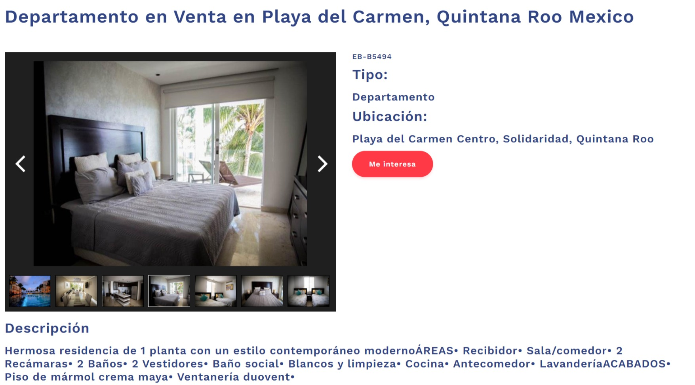
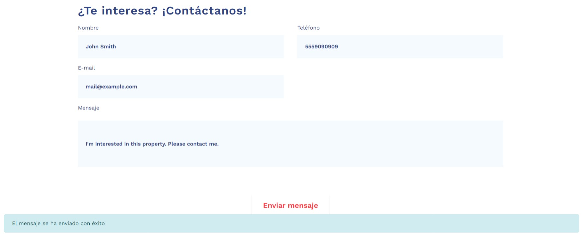
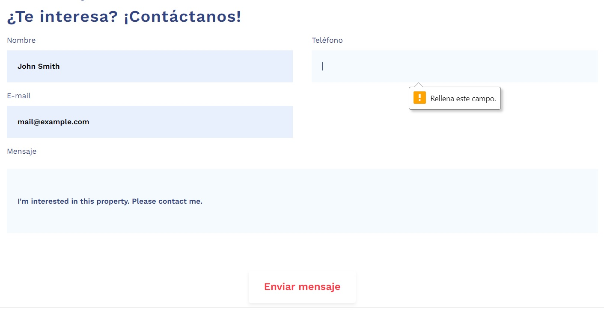

# Real-State-Website
EasyBroker selection process project. 'Inmobiliaria de Prueba', a real estate agency wants to create a website connected to their EasyBroker account with all their published properties. The website consists of two main pages: the properties list page and the property page.


## Contents
* [General information](#general-information)
* [Pages](#pages)
* [Instalation guide](#instalation-guide)
* [Notes](#notes)

## General information
[EasyBroker](https://www.easybroker.com/) is a management and collaboration platform that enables you to easily create market studies and share your listings with your clients and other real estate brokers.

This website was developed using Python's web framework 'Flask'. The back-end that connects to the [EasyBroker API](https://api.stagingeb.com/playground) was done in Python as well. To work with the API, a Class with several useful methods was built. This Class also works standalone and can be used to perform basic back-end operations for most websites that may require it.

The front-end was barely developed as it works as a mix of the following templates:
* [Doob - Free Agency HTML Template](https://www.graphberry.com/item/doob-free-agency-html-template)
* [Simple responsive photo gallery template](https://www.webtrainingcentre.com/css/simple-responsive-photo-gallery-template/)
Graphics were crafted with [Canva](www.canva.com).

## Pages
### Properties list page
The website's main page. A paginated list containing all the published properties of the company with the following requirements:
* 15 properties per page
* Only includes published properties
<details><summary>Show Image</summary>
<p>


</p>
</details>

When click on a property, it opens the property's page.

To quickly scroll to the properties section on the main screen, press the 'Descubrir' button on the landing page:
<details><summary>Show Image</summary>
<p>


</p>
</details>

You can navigate using the buttons on the screen's bottom:
<details><summary>Show Image</summary>
<p>


</p>
</details>


### Property page
When a user clicks on a property in the list you should take them to a page that displays all the property's detailed information. Use the properties/{property_id} endpoint.

<details><summary>Show Image</summary>
<p>


</p>
</details>

You can change the image shown by clicking on the navigation arrows or selecting a thumbnail below:
<details><summary>Show Image</summary>
<p>



</p>
</details>

#### Contact Form
A form on the Property page that uses the contact_requests endpoint to create new leads in the agency's account. All the contact requests are linked to the property currently showing.

After filling the information and writing a message, you'll get a message of success when the 'Enviar mensaje' button is clicked:
<details><summary>Show Image</summary>
<p>



</p>
</details>

The form may warn when there's an unfilled information field:
<details><summary>Show Image</summary>
<p>



</p>
</details>

## Instalation guide
1. Install [Python 3.6+](https://www.python.org/downloads/).
2. Install [Requests](https://docs.python-requests.org/en/latest/), [Flask](https://flask.palletsprojects.com/en/2.0.x/), and [Flask_WTF](https://flask-wtf.readthedocs.io/en/1.0.x/). You may use the following code:

    ```
    pip install -r requirements.txt
    ```

(Make sure you're in the repo directory.)
3. Run app.py
4. Open the localhost location (You may find it in the console after running the program.)
5. Enjoy!

## Notes
I decided to use a template in order to save time developing the front-end; nonetheless, I couldn't use the whole templates and even after a purge of unused functions there's still residual code.

The communication with the API was somehow hard since my methods kept getting errors in the unit tests. Some issues with the headers for the POST function cost me plenty of time. Yet, once the API handler Class was done, the integration of both templates was tricky as well. Since both templates were developed as reactive pages using JavaScript, the use of jinja and Flask wasn't straightforward. There's still plenty of room to improve the current implementation as many functionalities were developed using brute force.

The code ended up being quite a mess with functions being called everywhere, but it was designed this way to avoid making a single large script. By using OOP, most functionalities go through a method as it is repeated plenty of times. Jinja also allowed me to use hierarchies in HTML to avoid repeating the header and footer on both pages by using a template. 

With more time to planify, I'm sure the UI/UX could've been better. Currently it's somewhat confusing as not everything is as reactive as planned.
